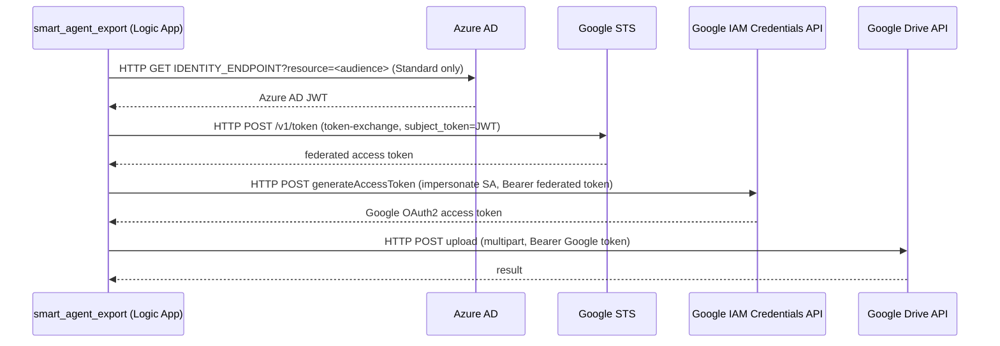

# Plan: federate `smart_agent_export` with GCP via App Registration + token exchange

## Decisions locked in

| Topic                               | Decision                                                                                                                                        |
| ----------------------------------- | ----------------------------------------------------------------------------------------------------------------------------------------------- |
| Extra compute (Function)            | **Rejected.** No separate Function App / code to maintain.                                                                                      |
| Logic App plan                      | Stays **Consumption** unless raw-token extraction is strictly required, in which case migrate to **Standard** (still a Logic App, no Function). |
| Tenant for the App Registration     | `data.azurerm_client_config.current` in `infra-pe/resources/prod` is correct.                                                                   |
| GCP audience                        | Not final yet — use a placeholder (`REPLACE_WITH_GCP_AUDIENCE`) everywhere below until provided.                                                |
| GCP Workload Identity Pool/Provider | Already exists (owned outside this repo).                                                                                                       |
| Target Google API                   | Drive v3 upload (`/upload/drive/v3/files`), impersonating an existing Google service account. And other Drive V3 apis.                                                   |

## Why Consumption is likely not enough

The built-in **HTTP action → Authentication type "Managed identity"** attaches a bearer token only to _that specific outbound call_; it never exposes the raw JWT so it can be embedded as a `subject_token` field in a different call's body. Google's STS token-exchange endpoint requires the JWT in the POST body, not as an `Authorization` header. Consumption Logic Apps have no supported way to read the raw token into workflow data. **Standard** Logic Apps expose the identity endpoint via app settings (`IDENTITY_ENDPOINT` / `IDENTITY_HEADER`), which a plain `HTTP` action can call to get the token as JSON — this is what unlocks doing everything natively, with no Function.

➡️ Action: try building the workflow on Consumption first. If the token step can't be made to work, migrate `smart_agent_export` to `azurerm_logic_app_standard` (Phase 2 below) instead of introducing a Function.

## Target architecture (all native Logic App actions, no custom code)



## Phase 1 — Azure AD App Registration (Terraform, `infra-pe/resources/prod`)

Its only purpose is to expose the Application ID URI so the Logic App's managed identity can request a token with that audience — no secret, no API permissions, no direct link to the Logic App.

```hcl
resource "azuread_application" "smart_agent_export_google_federation" {
  display_name = "${local.project}-${local.domain}-smart-agent-export-google"

  identifier_uris = ["REPLACE_WITH_GCP_AUDIENCE"] # e.g. api://AzureADTokenExchange — confirm against the GCP provider config
}
```

No `azurerm_federated_identity_credential` is needed on this App Registration — that resource type is for _inbound_ federation (external OIDC tokens minting an Azure AD token, as used today for GitHub Actions in `infra-io/identity`). Here we need the opposite direction (Azure AD minting a token that GCP will trust), which only requires the Application ID URI to exist.

## Phase 2 — Logic App changes (`infra-pe/resources/prod/logic_app.tf`)

1. Keep the existing `azurerm_logic_app_workflow.smart_agent_export` and its system-assigned identity as-is initially.
2. Add the workflow actions (via the workflow `definition` / designer) implementing the sequence diagram above, using `data.azurerm_client_config.current.tenant_id` where a tenant ID is needed and the placeholder audience from Phase 1.
3. If the identity-token step can't be read natively on Consumption, convert to Standard:
   - Replace `azurerm_logic_app_workflow` with `azurerm_logic_app_standard` (requires a backing `azurerm_service_plan` on a `WS1`+ SKU and a Storage Account for the runtime).
   - Carry over the `identity { type = "SystemAssigned" }` block, the recurrence trigger (becomes a `Recurrence` trigger in the Standard workflow definition), and the existing `smart_agent_export_kv_role_assignment` module (Standard exposes the same `identity[0].principal_id`).

## Phase 3 — GCP side (tracked here, executed by whoever owns the GCP project)

Grant the Logic App's managed identity object ID (`azurerm_logic_app_workflow.smart_agent_export.identity[0].principal_id`, or the Standard equivalent) access to impersonate the target service account:

```
principal://iam.googleapis.com/projects/<PROJECT_NUMBER>/locations/global/workloadIdentityPools/<POOL_ID>/subject/<logic-app-object-id>
```

with `roles/iam.serviceAccountTokenCreator` on the service account — confirm this matches the pool's existing attribute mapping (e.g. `google.subject=assertion.sub`).

## Open items to finalize before writing the actual Terraform/workflow JSON

- [ ] Final GCP audience value (replaces `REPLACE_WITH_GCP_AUDIENCE`)
- [ ] Workload Identity Pool ID, Provider ID, GCP project number
- [ ] Target service account email to impersonate
- [ ] Confirm whether Consumption can carry the raw token through, or whether Phase 2's Standard migration is required
- [ ] Design the multipart request body for the Drive upload action (metadata + file bytes) inside the workflow definition
